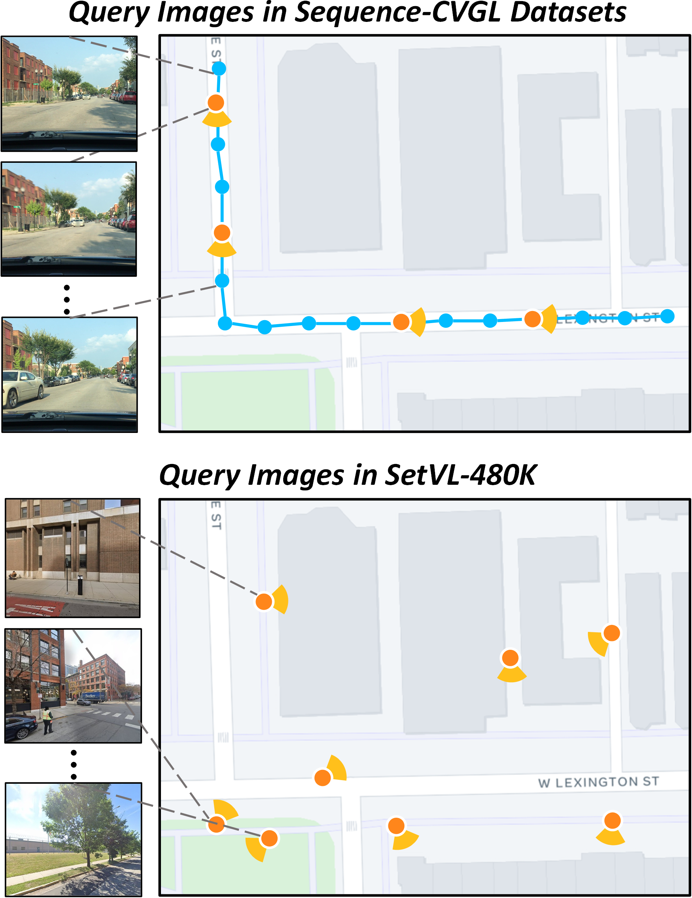
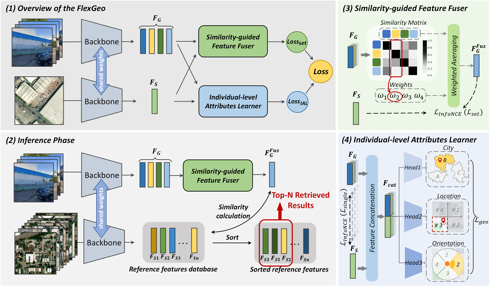

# Set-CVGL: A New Perspective on Cross-View Geo-Localization with Unordered Ground-View Image Sets

This work has been accepted by ISPRS Journal [https://www.sciencedirect.com/science/article/pii/S0924271626000456].


## ✅ To-Do

- [x] Initial repo structure
- [ ] Training scripts
- [x] SetVL-480K Dataset
- [ ] Tools for building your own dataset


## 1. SetCVGL Task

The Set-CVGL task extends traditional cross-view geo-localization by allowing multiple query images captured from diverse perspectives, without assuming any sequential relationships.

Given a set of query images collected within a limited spatial range around an unknown location and a database of geo-tagged reference images, the objective is to identify the reference image that best matches the entire query set, thereby determining the location. To this end, both the query set and reference images are encoded into feature representations, and the reference image with the highest similarity to the query set is selected.

While leveraging multiple images provides a more comprehensive description of the scene, it also introduces challenges in effectively fusing information from different viewpoints without sequential priors or strong overlap.


## 2. SetVL-480K Dataset
The primary aim of the SetVL-480K dataset is to support the Set-CVGL, a task we propose that remains underexplored in previous research. Compared with previous datasets, SetVL-480K has several key characteristics:

 1. Diverse perspectives and sampling locations: Ground images in Sequence-CVGL datasets often have highly repetitive views and limited sampling locations due to the road-bound trajectories and fixed camera view, leading to redundancy. In contrast, images in SetVL-480K are taken from varied perspectives and locations.
 2. No sequential constraints among query images: Ground images in SetVL-480K are captured from random perspectives, presenting a general and challenging geo-localization task suited to a wide range of applications.
 3. Dense distribution of query images: In SetVL-480K, each reference cell is linked to an average of 40 query images, allowing researchers to investigate the impact of query image quantity on localization accuracy.




### 2.1 City distribution


### 2.2 Dataset Download
To download the SetVL-480K dataset ([Huggingface](https://huggingface.co/datasets/Mabel0403/SetVL-480K)). You can also follow the instructions below:

#### Street-View Image download

To comply with Google Street View's policies, we only provide the **image IDs** along with instructions for downloading. This allows users to access the dataset independently.

With these IDs, users can retrieve the panoramas using the [Google Street View Static API](https://developers.google.com/maps/documentation/streetview?hl=zh-cn) or [third-party tools](https://svd360.com/).

#### Aerial-View Image download
To comply with Esri's policies, we only provide the **coordinates and zoom level** along with instructions for downloading. This allows users to access the dataset independently.

With these coordinates and zoom level, users can retrieve the aerial-view reference images using the [Esri API](https://github.com/andolg/satellite-imagery-downloader).

**If you have any questions or encounter any issues during access or download, feel free to contact us** at [mabel_wq@whu.edu.cn], we will help you downloading the SetVL-480K as soon as possible.


## 3. Framework: FlexGeo



The training and evaluation code is currently being organized and checked for release. We appreciate your patience and will make it publicly available as soon as it is ready.


## Acknowledgments

This code is based on the amazing work of: [Sample4Geo](https://github.com/Skyy93/Sample4Geo). We appreciate the previous open-source works.
## Citation✅
```
@article{wu2026set,
  title={Set-CVGL: A new perspective on cross-view geo-localization with unordered ground-view image sets},
  author={Wu, Qiong and Xia, Panwang and Yu, Lei and Liu, Yi and Xiong, Mingtao and Zhong, Liheng and Chen, Jingdong and Yang, Ming and Zhang, Yongjun and Wan, Yi},
  journal={ISPRS Journal of Photogrammetry and Remote Sensing},
  volume={233},
  pages={328--345},
  year={2026},
  publisher={Elsevier}
}
```

